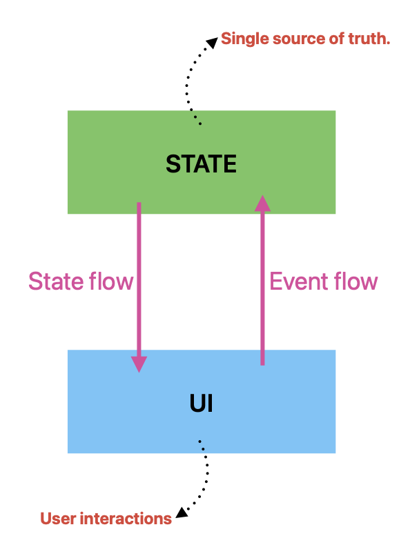

# Unidirectional Data Flow (UDF)

A design pattern where UI state flows downward from a state holder to the screen, and user events flow upward to update that state. It enforces a single source of truth, making mobile app state highly predictable, testable, and consistent.

* **Single Source of Truth:** Data only lives in one designated place. Avoid the messy synchronization bugs common with scattered, multi-source states.
* **Decouplee Components:** The UI only renders what it is given. It does not modify data directly, making views lightweight and strictly focused on visuals.
* **Enhanced Testability:** Because the state holder and business logic are separated from the visual framework, it is much easier to write pure unit tests.

## Best Practices & Pitfalls
* **Immutable States:** Never allow the UI to mutate the state object directly; always require updates to go through the official event pipeline.
* **Manage Side Effects:** Isolate network requests and database calls from your UI state updates to keep the data flow strictly one-way.